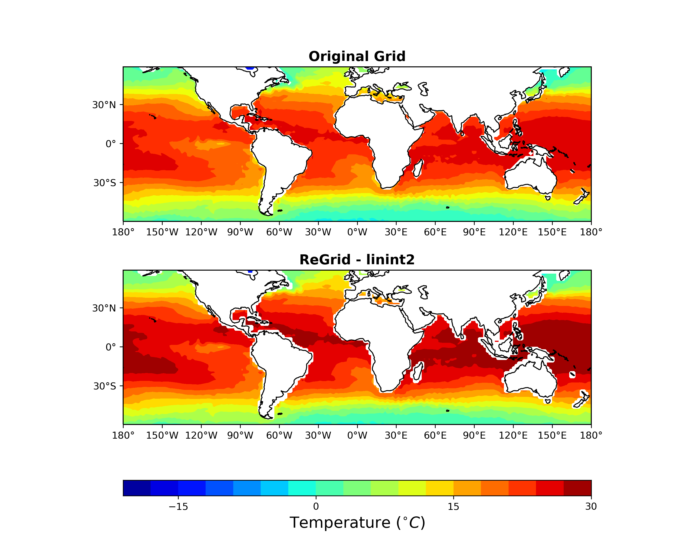

Usage Examples
===========================

The examples below show GeoCAT-comp functions being utilized in real-world use
cases.  They also demonstrate how GeoCAT-comp can be used to make plots with
Matplotlib (using Cartopy) and PyNGL (work in progress).

Data files
----------

The data files used in these examples can be downloaded from the
`NCL website <https://ncl.ucar.edu/Applications/Data/>`_.

GeoCAT-comp with Matplotlib and Cartopy
---------------------------------------

:meth:`geocat.comp.linint2` example
^^^^^^^^^^^^^^^^^^^^^^^^^^^^^^^^^^^
   
.. literalinclude:: _static/scripts/examples/matplotlib/mpl_linint2.py
   :language: python
   :caption: `Python script <_static/scripts/examples/matplotlib/mpl_linint2.py>`_ or `Jupyter notebook <_static/scripts/examples/matplotlib/mpl_linint2.ipynb>`_
   :lines: 4-

